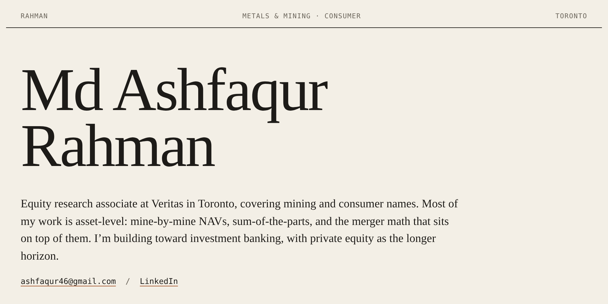
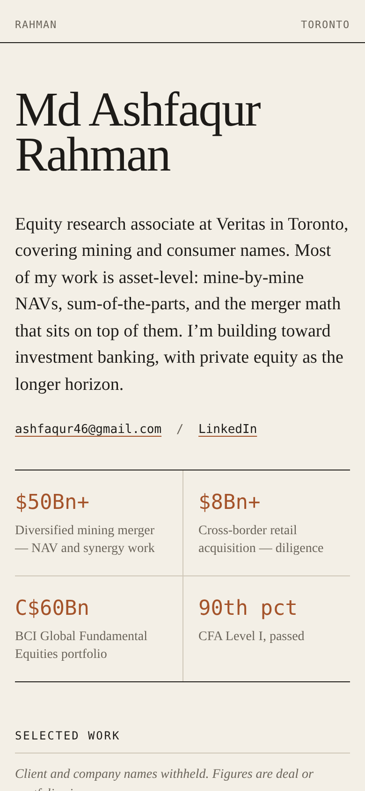
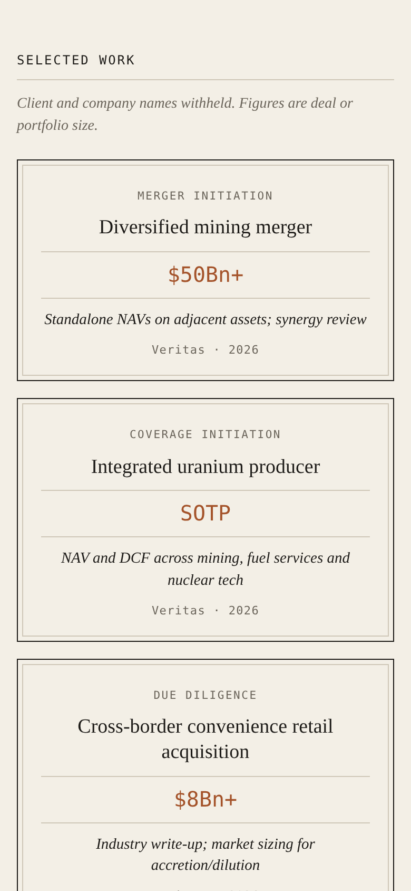
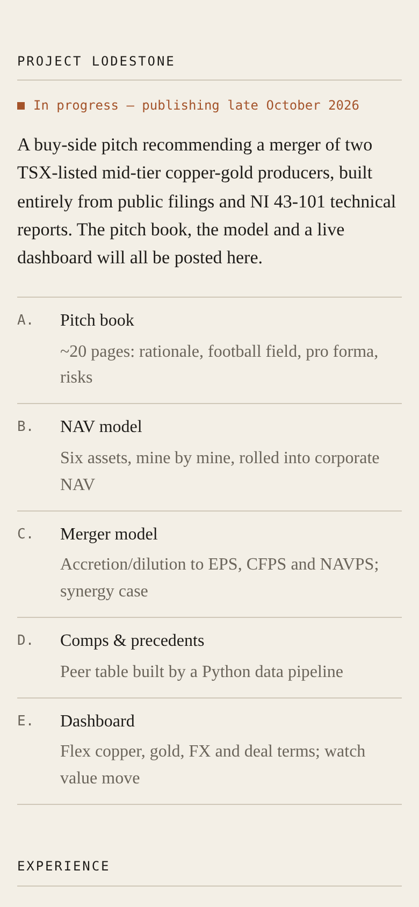
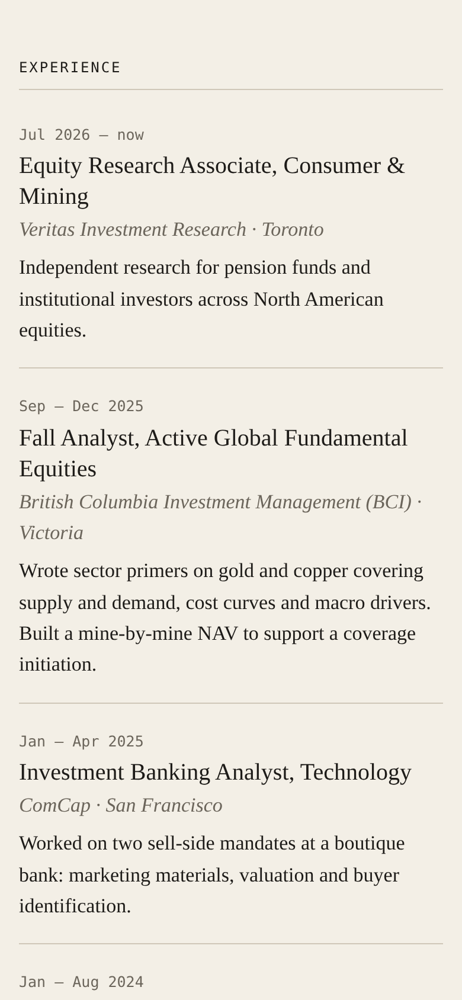

# Agape Website 📈

<kbd>
    
</kbd>

## Project Description 🎨
Agape Website is the personal portfolio of Md Ashfaqur Rahman, an equity research associate covering mining and consumer equities in Toronto, working toward investment banking and, later, private equity. It's built for one reader: a banker or recruiter with sixty seconds. The page opens with who he is and what he models, follows with a strip of headline figures, and then lists his deal and coverage work as tombstones, the format banks use to mark closed transactions. Below those are Project Lodestone (his copper-gold M&A pitch), his experience and his credentials. The site is a single static page of hand-written HTML and CSS, plus a few lines of JavaScript for the light/dark switch. It has no framework, build step, database or tracking, and GitHub Pages serves the files directly from this repository.

## Screenshots:

    <kbd>
        
    </kbd>
    <kbd>
        
    </kbd>
    <kbd>
        
    </kbd>
    <kbd>
        
    </kbd>

## Technologies Used 💻

### Frameworks
- [x] **HTML5** — Semantic markup (`section`, `article`, `dl`, `ol`) so screen readers and search engines read the page in order
- [x] **CSS3** — Design tokens as custom properties, CSS Grid for the tombstone and ledger layouts, `prefers-color-scheme` for system appearance
- [x] **Vanilla JavaScript** — `appearance.js` (under 70 lines) powers the light/dark switch; the page reads fine without it

### APIs & Web Services
- [x] **GitHub Pages** — Free static hosting, deployed automatically on every push to `main`
- [x] **Google Fonts** — Newsreader (serif text) and IBM Plex Mono (figures and labels)

### Data Sources
- [x] **Resume content** — All copy comes from Ashfaq's resume and lives directly in `index.html`
- [x] **Static assets** — `favicon.svg` and the README screenshots in `assets/`

## Architecture 🏗️
- **Pattern**: A single static page. Content lives in `index.html` and presentation in `styles.css`, with no templating layer
- **State Management**: One value, the reader's appearance override, kept in `localStorage` only when it differs from the system setting
- **Navigation**: One scrolling page with anchored sections (`#work`, `#lodestone`, `#experience`, `#education`)
- **Styling**: A single token block on `:root` (color, type scale, spacing, motion), so no raw values are scattered through the stylesheet; dark values apply via `prefers-color-scheme` or `data-appearance`
- **Target**: Current versions of Chrome, Safari, Firefox and Edge on desktop and mobile; served from GitHub Pages at `https://arieltyson.github.io/agape-website/`

## Features 🌟
- 🏛️ **Deal tombstones** — Six deal and coverage initiations shown in the format bankers already know
- 📊 **Key figures strip** — Deal sizes and credentials readable at a glance, set in tabular monospace
- ⛏️ **Project Lodestone** — Status and scope of his copper-gold M&A pitch, ready to link to the deck and dashboard once published
- 🗂️ **Experience ledger** — Dates in a fixed column, like a research note's history table
- 🌗 **Light and dark appearance** — Follows the system by default; one tap on the sun/moon switches it, and the choice is remembered
- 📱 **Phone-ready** — Collapses to a single column without losing the layout's character
- ♿ **Accessible** — 44px touch target, labelled switch, visible keyboard focus, and motion that respects Reduce Motion
- ⚡ **Fast and private** — No trackers, no cookies, no build step

## Contributing ⚙️
Suggestions are welcome, especially from people in banking or private equity who know what a reader in those seats looks for. Fork the repository, create a branch (`git checkout -b fix/your-change`), make your edits, and open a pull request with a short note on what changed and why. There's nothing to install: open `index.html` in a browser to preview. For content corrections, please open an issue instead.

## License 🪪
The code (HTML, CSS and SVG) is released under the [MIT License](LICENSE); you're free to reuse the layout with attribution. The written content, figures and personal details are © 2026 Md Ashfaqur Rahman and aren't covered by that license.

